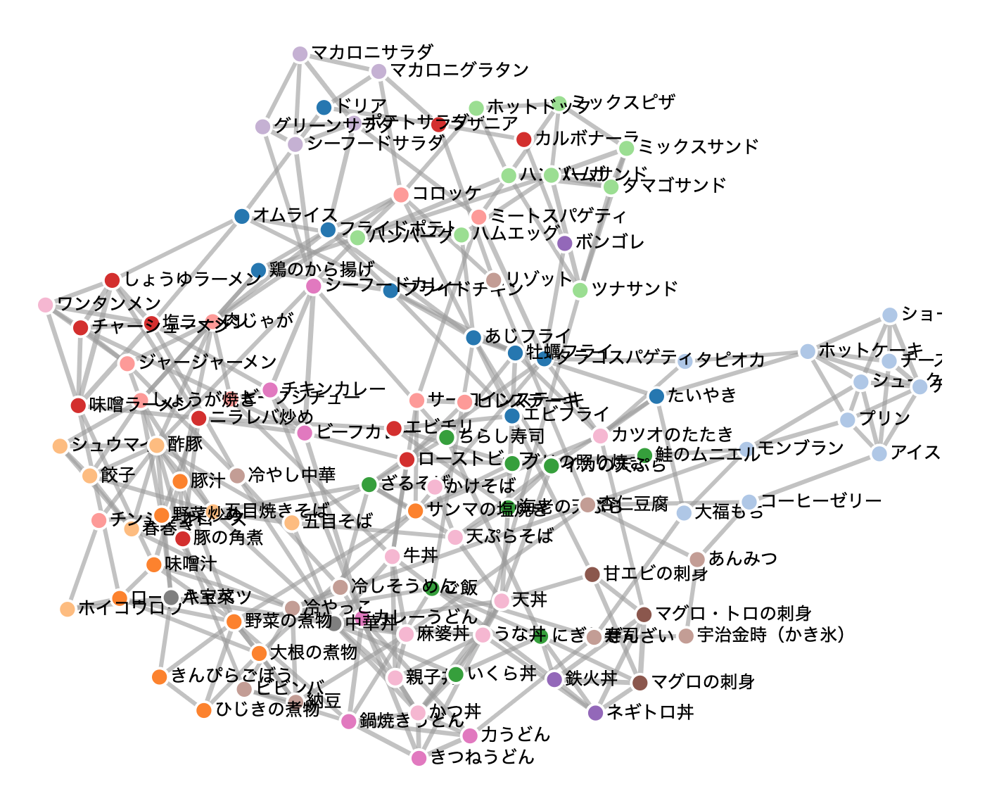

# LLMを活用した食品間の類似度の可視化

生成AIのembeddingモデルを活用して114種類の食品間の類似度を算出し、ネットワークグラフで可視化するプロジェクトです。

## 概要

OpenAIのtext-embedding-3-smallモデルを使用して、食品名・調理法・主な材料から各食品のベクトル表現を生成し、コサイン類似度を計算します。類似度の高い食品をネットワークグラフで可視化することで、食品間の関係性を直感的に理解できます。



## ファイル構成

- `LLMを活用した食品間の類似度の可視化.ipynb` - メインのJupyter Notebook
- `foods-text.xlsx` - 114種類の食品データ（食品名、調理法、主な材料）
- `foods-similarity.png` - 結果の可視化画像

## 主な機能

1. **食品データの読み込み**: Excelファイルから食品情報を取得
2. **テキストの前処理**: 食品名・調理法・材料を結合してembedding用テキストを生成
3. **ベクトル化**: OpenAI APIを使用してテキストをベクトル表現に変換
4. **類似度計算**: コサイン類似度による食品間の類似性評価
5. **クラスタリング**: K-means法（k=15）による食品のグループ化
6. **ネットワーク生成**: D3.js用のノード・エッジデータ作成

## 実行環境

- Google Colaboratory推奨
- Python 3.x
- 必要ライブラリ: openai, pandas, numpy, openpyxl, scikit-learn, matplotlib

## セットアップ

1. Google ColaboratoryでNotebookを開く
2. 左側の鍵マークから環境変数 `OPENAI_API_KEY` を設定
3. `foods-text.xlsx` ファイルをアップロード
4. セルを順番に実行

## 結果

- 各食品に対して類似度上位5件の食品を表示
- ネットワークグラフ用のJSONデータを出力
- [D3.jsビューア](https://n34r28.csb.app/)でインタラクティブな可視化が可能

## 使用例

```python
# 「鶏のから揚げ」に似ている料理を検索
similar_food(0)
```

出力例:
```
=== 「鶏のから揚げ」に似ている料理 TOP 5 ===
類似度: 0.642 | フライドチキン
類似度: 0.577 | しょうが焼き
類似度: 0.575 | フライドポテト
類似度: 0.571 | 肉じゃが
類似度: 0.571 | ハンバーグ
```

## 技術詳細

- **Embeddingモデル**: OpenAI text-embedding-3-small（1536次元）
- **類似度指標**: コサイン類似度
- **クラスタリング**: K-means法（15クラスタ）
- **ネットワーク**: 各ノードの上位5類似食品をエッジとして接続

## ライセンス

このプロジェクトはMITライセンスの下で公開されています。